# Procesverslag

## Jij

  
In dit document lees je meer over de website die ik de afgelopen weken heb nagemaakt. Veel leesplezier. 

  ### Auteur:
  Mijn naam is Esther van Dijk.

  #### Je startniveau:
  Mijn startniveau is blauw. Als ik eenmaal de smaakt te pakken heb kan ik code erg leuk vinden. Toch is alles nog heel nieuw voor mij en kost het mij veel tijd om zaken voor elkaar te krijgen. 

  #### Je focus:
  Ik heb gekozen voor surface plane. Het dus nog beter maken van de code en website. 
 

## Je website

  
Als website heb ik gekozen voor de website van Dour Festival. Dit lijkt mij een leuke en uitdagende website om aan te werken de aankomende weken.

  ### Je opdracht:
  Dour Festival
  Link naar de website: https://www.dourfestival.eu/en/program/stages/

  #### Screenshot(s) van de eerste pagina (small screen): 
  De onderstaande pagina's ga ik namaken. Dus de home pagina en de pagina over de podia op het festival. Hieronder zie je ook van beide pagina's een breakdown.  
  Home pagina
  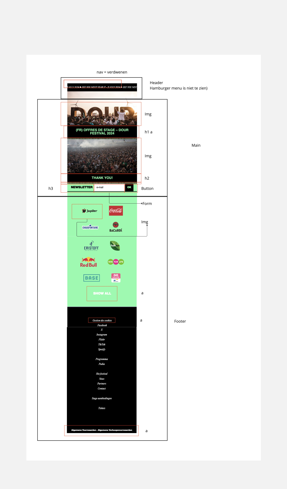
  

  #### Screenshot(s) van de tweede pagina (small screen):
  Podia pagina
  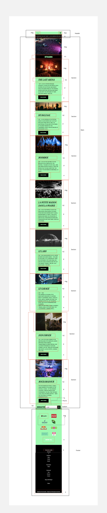

## Toegankelijkheidstest 1/2 (week 1)

  
De Dour Festival website kan verbeteringen gebruiken. Zo heeft de website geen H1 en verdwijnt de header wanneer je de website op mobiel formaat bekijkt.e werkgroep

  ### Bevindingen
  Lijst met je bevindingen die in de test naar voren kwamen:
  - Koppen zijn niet toegankelijk
  - Code is rommelig en niet semantisch correct 
  - De taal van de website springt steeds door elkaar 
  - Op mobiel formaat verdwijnt de hele header en is het lastig om naar de andere pagina's van de website te gaan
  - De website bestaat voornamelijk uit divjes 
  - Er is geen h1 op de website 
  Foto's van het ingevulde formulier: 
  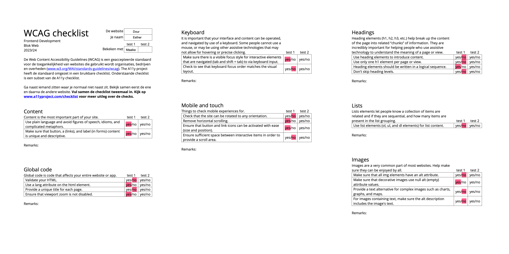
  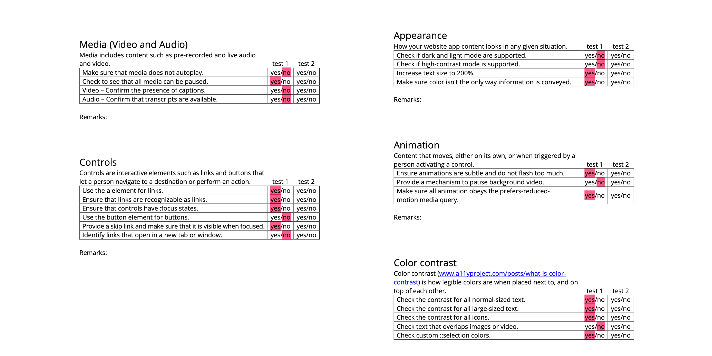

## Breakdownschets (week 1)

  
Hieronder zie je de breakdowns van de pagina's die ik ga maken.

  ### de hele pagina: 
  
  

  ### dynamisch deel, menu): 
  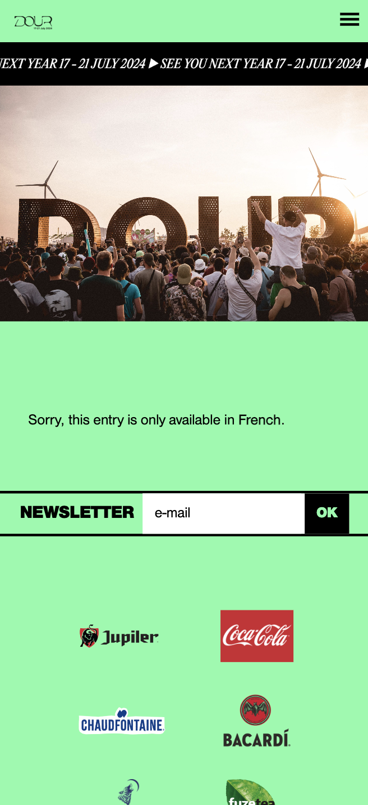
  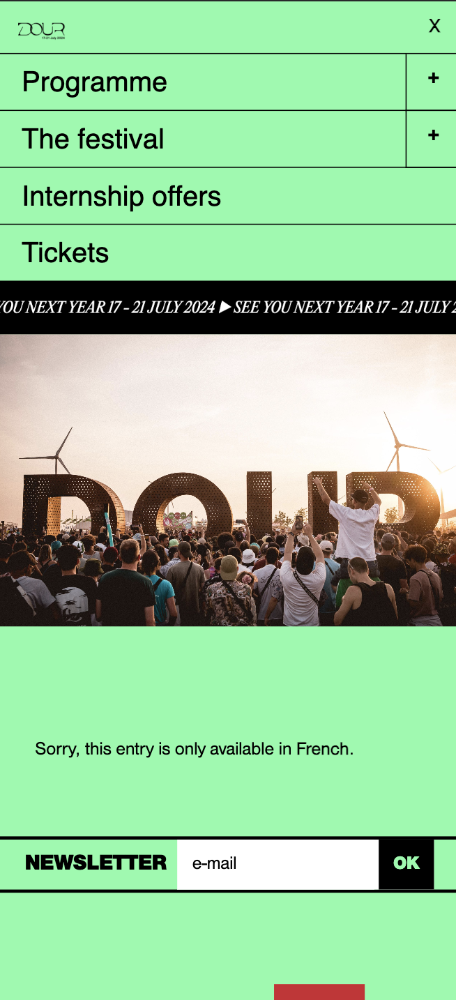

  ### wellicht nog een dynamisch deel, inschrijven nieuwsbrief: 
  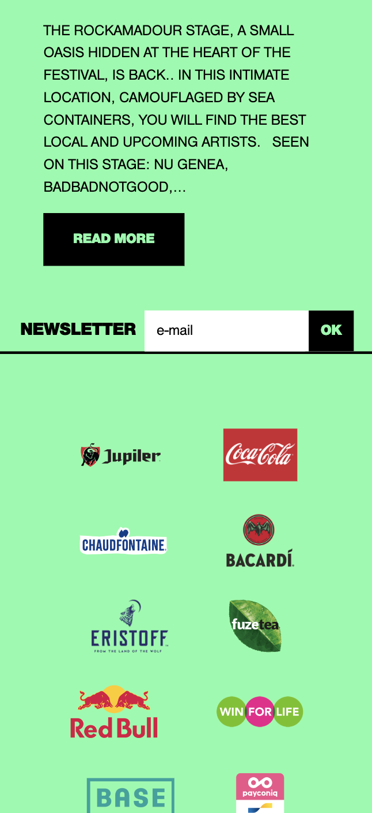

## Voortgang 1 (week 2)

  
1e voortgang

  ### Stand van zaken
  De start ging goed en soepel. Op advies van de docent ben ik eerst begonnen met het juist zetten van de content en daarna de header gedaan.Het was wel weer even experimenteren en inkomen in HTML en CSS. Door de oefeningen in de les ging het maken van de website redelijk soepel. Wat ik wel lastig vond is dat soms de website groter was dan het scherm. Hierdoor ben ik gaan werken met vh en vw in de CSS. Met deze termen had ik nog nooit gewerkt. Dit heeft erg geholpen bij het maken van de website. Hieronder zie je wat beelden van het proces tot nu toe. 
  

  ### Agenda voor meeting
  - Hamburgermenu
  - viewport hight en width 
  - grid en flexbox

   ### Verslag van meeting

  In deze week heb ik samen met Noah, Abby en Marnix in een groepje onze problemen besproken. Zo had bijna iedereen moeite met het maken van de header en het hamburger menu. Ook de docent heeft ons tijdens deze les goed opweg geholpen. Hieronder zijn wat punten beschreven die uit het gesprek zijn gekomen met elkaar en de docent. 

  - Hamburger menu maken d.m.v. classes in CSS en Java Script
  - In CSS vh en vw gebruiken zodat de website niet groter word dan het scherm
  - Specifieke vragen uitgelegd over grid en flexbox. Het op de juiste plek krijgen van content. 

## Voortgang 2 (week 3)

  
Ik ben verder gegaan met het maken van de header en het bijbehorde hamburgermenu. Ook heb ik de animatie van de website gemaakt. Het was voor alles even zoeken, maar door middel van bronnen en hulp van de docent is het gelukt.e voortgang

  ### Stand van zaken
  Na het op de juiste plek zetten van de content van de website ben ik verder gegaan met het maken van de header. Dit was best een lastig karwei. In de header heb ik een hamburgermenu gebruikt. Dit menu ben ik werkend gaan laten maken door middel van Java Script. Dit was ook weer even inkomen. Door middel van een bron van dev.io is het gelukt om het hamburgermenu werkend te maken. 

  Ook heb ik een animatie gemaakt. De tekst gaat van links naar rechts in het scherm. Het was even zoeken hoe ik dit precies moest doen. Ik had dit namelijk nog nooit gedaan. Een pagina van Antagonist heeft mij hierbij geholpen. In deze pagina beschreven ze verschillende animaties. Door te experimenten met keyframes in CSS is het uiteindelijk gelukt om de animatie te maken. Wat daarna niet lukt was dat de achtergrond zwart bleef. Door hulp van de docent is het uiteindelijk wel gelukt. 

  Foute versie: de p had een zwarte achtergrond en die bewoog van links naar rechts. De p beweegt dus eigenlijk uit het beeld. 
  Goede versie: in de p zit nu een span. De p is nu een vast blok die altijd zwart is en daardoor witte tekst komt. 

  

  ### Agenda voor meeting
  Voor het laatste voorgangsgesprek met de docent heb ik een aantal punten opgeschreven die ik graag wil bespreken. 
  - Klopt mijn code? 
  - Waar moet ik nog verder aan denken? / ben ik wat vergeten? 

  ### Verslag van meeting
Het gesprek heb ik gevoerd met de docent. Hij heeft mij geholpen bij het semantisch juiste maken van de code. Zo had ik een UL zonder LI's erin. Het enige wat in een UL mag zijn LI. Ook moest ik van sommige items links maken of een button. Dit heb ik allemaal aangepast in mijn code. Hij heeft mij ook geholpen met mijn Java Script. Blijkbaar stijlde ik vanaf mijn Java Script. Dit is niet de bedoeling. Het is dus de bedoeling dat je vanuit Java Script een class aanroept in CSS. Want CSS is echt voor de stijling. 

Ook gaf hij als feedback dat ik echt aan de toegankelijkheid van de website moet denken. Zoals juiste koppen en geen onnodige alt tekst bij afbeeldingen waar dat niet van toepassing is. Deze feedback ga ik verwerken bij het verder uitwerken van mijn website. 

Punten: 
- In UL mogen alleen LI's
- Niet vanuit Java Script stijlen, maar alleen vanuit CSS
- Gebruik buttons waar het een button is en een a waar het een a is
- Denk aan de toegankelijkheid van de website, juiste koppen en alt tekst

## Toegankelijkheidstest 2/2 (week 4)

  
De website is op veel punten verbeterd! Op bijvoorbeeld: de koppen, het gebruik van a en button de code is nu netter en valide. e werkgroep

  ### Bevindingen
  Lijst met je bevindingen die in de test naar voren kwamen (geef ook aan wat er verbeterd is):
  Vandaag heb ik de toegankelijkheidstest nog een keer gedaan met mijn eigen gemaakte website van Dour Festival. Hieruit is gekomen dan een heel groot deel van de punten die eerst niet goed waren zijn verbeterd. Zoals:
  - 1 H1 item op elke pagina 
  - Duidelijke koppen 
  - In UL alleen LI 
  - Animaties zijn rustig en niet te opvallend
  - De juiste elementen zijn gebruikt voor knoppen (button) en links (a)

  Er zijn ook een aantal dingen naar voren gekomen die nog niet voldoende zijn. Zo is het niet mogelijk om de animatie te stoppen. Ook heeft de website geen donder en licht modus of een hoog en laag contrast stand. Deze punten staan wel in de WCAG checklist. 

  Hieronder zijn afbeelden van de ingevulde checklists te zien. 
    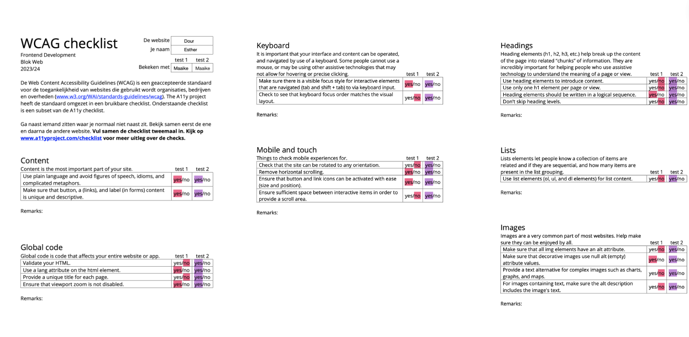
  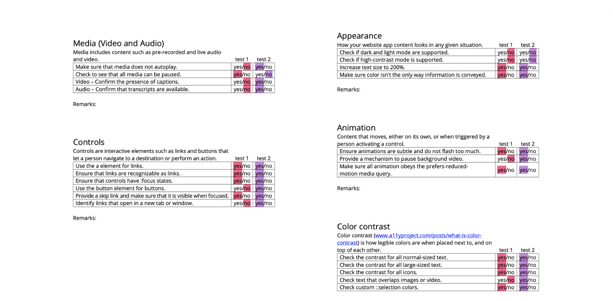

## Voortgang 3 (week 4)

  
3e voortgang

  ### Stand van zaken
  hier dit ging goed & dit was lastig (neem ook screenshots op van delen van je website en code)

  ### Agenda voor meeting
- Tweede pagina maken 
- Animatie maken voor knoppen
- Code valideren en netjes maken 

  ### Verslag van meeting
Na het zo goed als afronden van de eerste pagina ben ik begonnen met de tweede pagina. Gelukkig kon ik een deel van de stijling van de index pagina kopieren. Het was alleen nog best een gepriegel om alles op de juiste plek te krijgen. Ook heb ik een animatie toegevoegd aan de knoppen op de tweede pagina. Ik wilde eerst eigenlijk iets nieuws proberen, maar het lukte allemaal niet goed. Ik vond het toch nog erg lastig. 

Verder heb ik mij bezig gehouden met de toegankelijkheid van de website. Zo heb ik op verschillende plekken aria-label gebruikt en ben ik meerdere keren met de screenreader door de website heen gelopen. Hieronder zie je wat beelden van mijn voortgang. 

  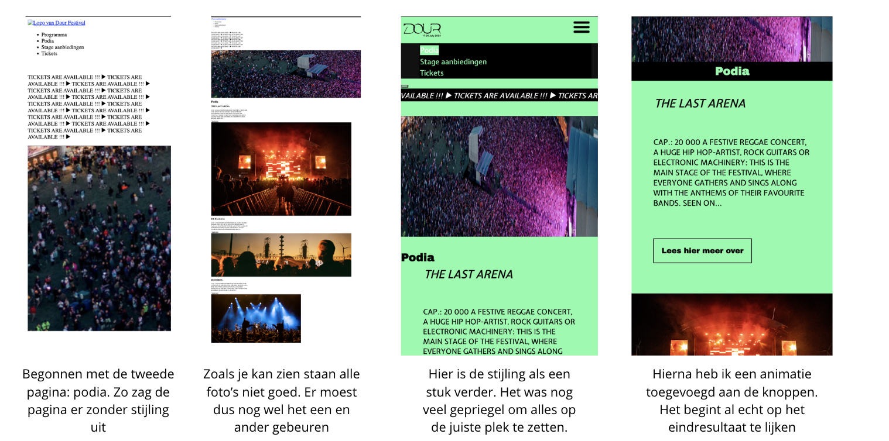
  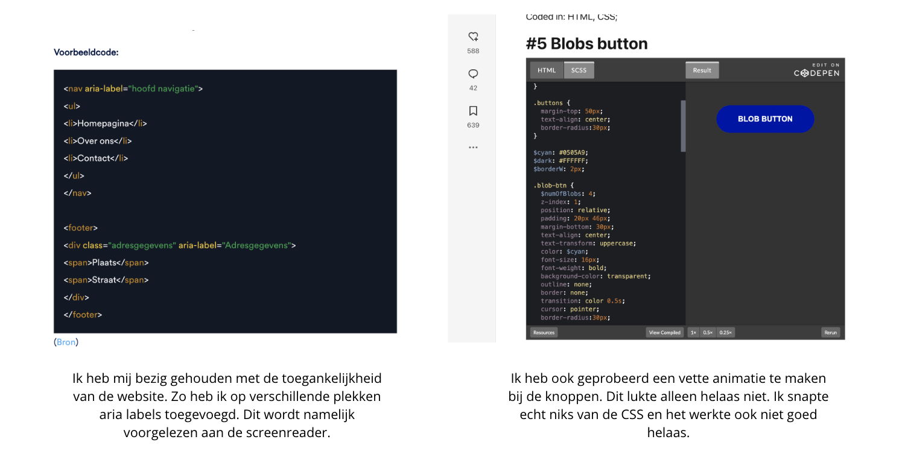

## Eindgesprek (week 5)

  
De website is klaar!

  ### Je uitkomst - karakteristiek screenshots:
  

  ### Dit ging goed/Heb ik geleerd: 
  In het onderstaande beeld is te zien wat ging ging en ik heb geleerd binnen de opdracht. 
  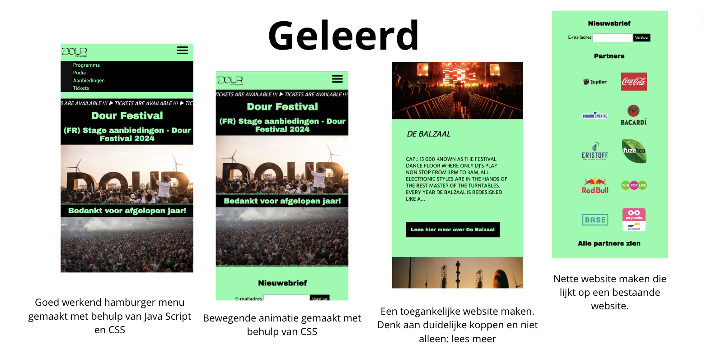

  ### Dit was lastig/Is niet gelukt:
  In het onderstaande beeld is te zien en lezen wat ik lastig vond en niet is gelukt binnen de opdracht.
   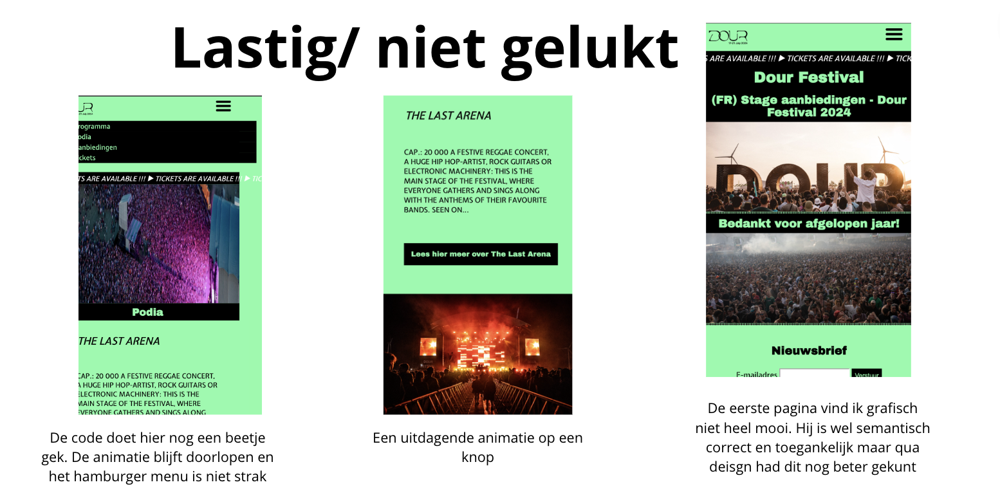

## Herkansing 

De website reponsive gemaakt + een pagina toegevoegd!

### Screenshots van de website nu:
Ik vond het heel erg jammer en balen dat ik het de eerste keer niet had gehaald. Marten gaf aan dat hij de code te mager en makkelijk vond. Ik de afgelopen weken heb ik de website verbeterd en complexer gemaakt. Zo heb ik de website volledig responsive gemaakt. Dit kan ik nog nooit gedaan. Ook heb ik een andere pagina toegevoegd: de line up pagina. 

Daarnaast heb ik ook de navigatie verder uitgewerkt. Op dekstop zie je de volledige navigatie en op mobiel formaat zie je alleen het hamburger menu. Dit had ik ook nog nooit eerder gedaan. 

Verder heb ik ook de toegankelijkheid van de website verbetert. Zo ben ik meer met met de screenreader gaan testen en heb ik alle links ook echt links gemaakt en extra informatie toegevoegd waar nodig. Op deze manier kunnen ook slechtzienden en blinden de website om een gemakkelijke manier bezoeken. 

Ik ben erg blij met het eindresultaat. 
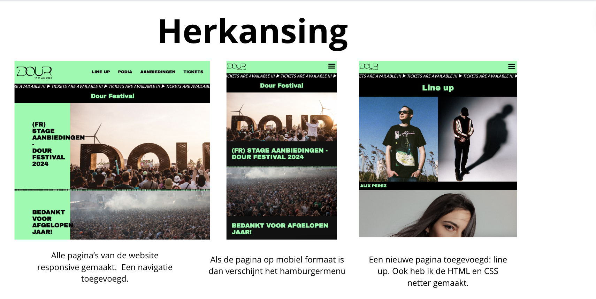
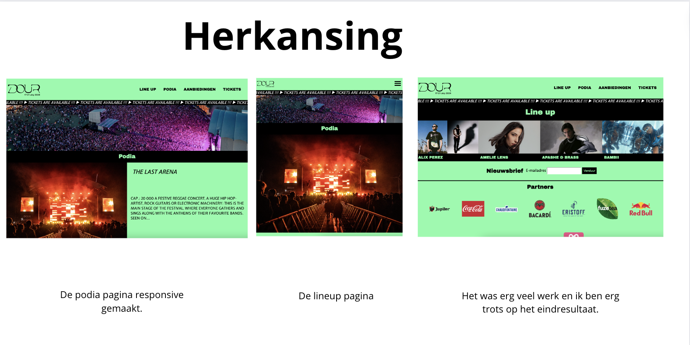

## Bronnenlijst

  
Tijdens het maken van de website van Dour Festival heb ik verschillende bronnen geraadpleegd.

  1. ljc-dev. (2020). Easy hamburger menu with JS - Beginners. van, https://dev.to/ljcdev/easy-hamburger-menu-with-js-2do0. 
  2. Daniel. (2022). Geef je website stijl met CSS-animaties!. van, https://www.antagonist.nl/blog/css-animaties/
  3. MoOx (2014). reset-button.css. van, https://gist.github.com/MoOx/9137295
  4. Sara (2022). Digitale toegankelijkheid: wat heb je nodig voor een toegankelijke website?. van, https://makeitmax.design/nl/digitale-toegankelijkheid-wat-heb-je-nodig/
  5. dev.ti (2019). 65 Beautiful CSS Buttons. van, https://dev.to/webdeasy/top-20-css-buttons-animations-f41

## Notities 

les 3, donderdag 16 nov
Grid - je geeft het aan per lijn 
De stukken content kunnen niet met elkaar communiceren, ze weten niks over elkaar. 
Altijd beginnen met mobile first ontwerpen 

Aanroepen media query: @
Begin met de grote vlakken. Lay out eerst goed hebben is belangrijk. 

grid-template-colums: {
  rows: max-content, max-content, max-content
}

grid-colom-start-start: 4
grid-colom-end: 5
grid-row-start: 1
grid-row-end: 2

<!-- grid van 3 kolommen -->
main { 
  display: grid;
  grid-template-columns: 1fr 1fr 1fr;
  grid-gap: 1em;
}

<!-- eerste blok wordt twee keer zo groot -->
article:first-child {
  grid-column: span 2;
background-color:lime;

<!-- Als iets altijd vierkant moet  -->
aspact-ratio: 1 / 1;
<!-- Bij video -->
aspact-ration: 16 / 9;

<!-- hoogte aanpassen -->
main { 
  
  display: grid;
  grid-template-columns: 1fr 1fr 1fr;
  grid-template-rows: 1fr 2fr 1fr;
  grid-gap: 1em;
/*   grid-columns: span 2; */
}

<!-- toegankelijke maken zonder media query -->
grid-template-columns: repeat (auto-fill, minmax (20em, 1fr))

